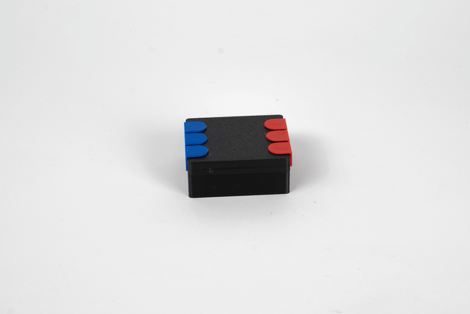
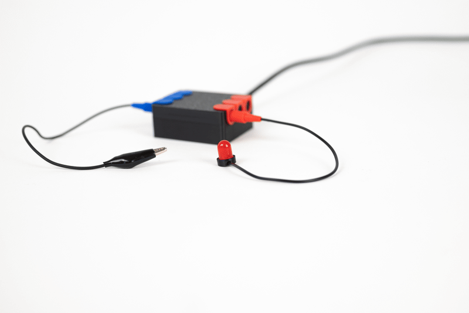
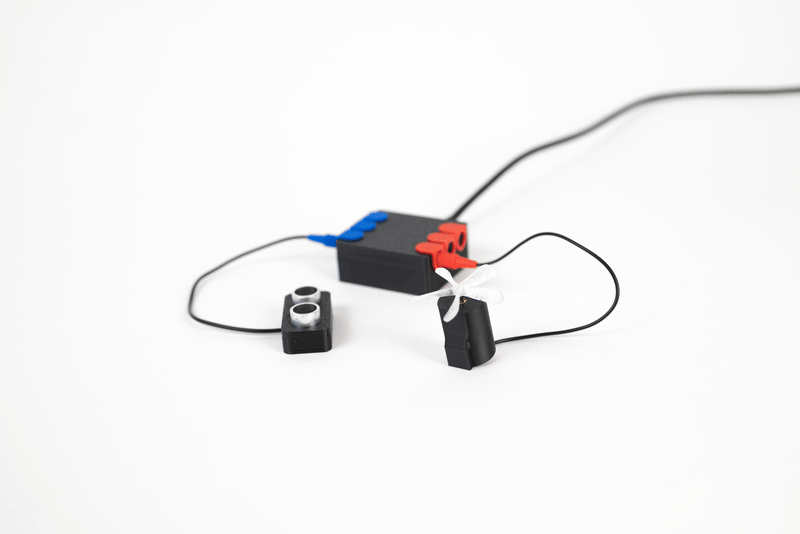
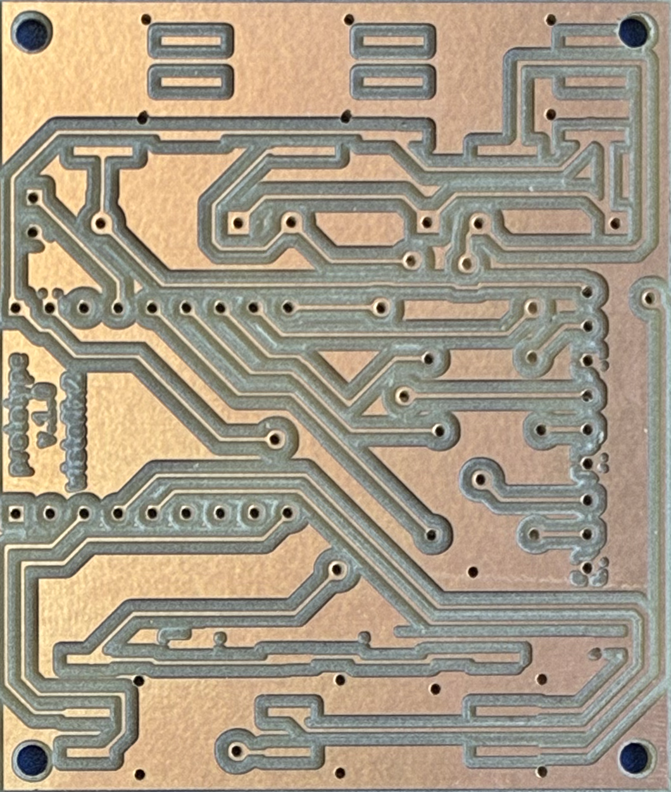

# I/O Patchbox

A 3-channel sensor-to-actor controller for **Technomateriale Kunsttherapie**, a new form of art therapy developed by **Manou Wistoff** in her master thesis at [Alanus Kunsthochschule](https://www.alanus.edu) in the field of Kunsttherapie.

The concept of Technomateriale Kunsttherapie is to understand interactive electronic components as *material* in the art therapy process, just like clay, paint, or fabric. In the therapy workshop, clients create interactive "Wesen" (creatures) by combining classical crafting materials with sensors and actors connected through the I/O Patchbox.

The I/O Patchbox is built on an ESP32-S3 Mini with a custom carrier PCB. Each channel auto-detects its sensor type at boot (ultrasonic HC-SR04 or capacitive touch) and drives an output (LED, motor) proportionally via PWM through a low-side NPN transistor stage.

<p align="center">
  
</p>

<p align="center">
  
  
</p>

## How it works

- **3 sensor inputs** (TRRS jacks) carrying power, trigger, echo, and ground
- **3 actor outputs** (TRRS jacks) with 5V PWM low-side switch (2N2222 + flyback diode), load adapted in cable
- **Mode switch** to enable/disable all outputs and trigger recalibration
- **Auto-detect** probes each channel for ultrasonic echoes and falls back to touch if none are found
- Ultrasonic: brightness inversely proportional to distance (0-60 cm)
- Touch: brightness proportional to capacitive contact, with adaptive baseline and asymmetric smoothing

## Project structure

```
i-o-patchbox/
├── firmware/
│   ├── esp32s3-mini/            # current target (LOLIN ESP32-S3 Mini)
│   │   ├── src/main.cpp
│   │   ├── platformio.ini
│   │   └── PINOUT.md
│   └── esp32-wroom-dev-board/   # earlier prototype (ESP32 WROOM DevKit)
│       ├── src/main.cpp
│       ├── platformio.ini
│       └── PINOUT.md
├── hardware/                    # KiCad 10 PCB project
│   ├── pcb.kicad_sch             # schematic
│   ├── pcb.kicad_pcb             # board layout (single-sided, home-etched)
│   ├── pcb.kicad_pro             # project file
│   ├── libs/PJ-320A/             # TRRS jack symbol + footprint library
│   ├── gerber/                   # fabrication outputs
│   ├── exports/                  # SVG renders, drill maps
│   ├── backups/                  # KiCad auto-backups
│   └── schaltplan.pdf            # schematic export
└── enclosure/                   # 3D-printable cases (OBJ)
    ├── cable-plug.obj            # cable strain relief (used by all sensors and actors)
    ├── patchbox/                 # main device enclosure
    │   ├── top.obj
    │   ├── bottom.obj
    │   └── indicator.obj
    ├── sensors/                  # sensor housings
    │   ├── ultrasonic-top.obj
    │   └── ultrasonic-bottom.obj
    └── actors/                   # actor housings
        ├── dc-motor-top.obj
        ├── dc-motor-bottom.obj
        ├── vibration-motor-top.obj
        ├── vibration-motor-bottom.obj
        └── led.obj
```

## Pin assignment (ESP32-S3 Mini)

| Channel | Trigger / Touch | Echo  | Actor |
|---------|-----------------|-------|-------|
| 1       | GP1             | GP7   | GP10  |
| 2       | GP2             | GP8   | GP11  |
| 3       | GP3             | GP9   | GP12  |
| Switch  | -               | -     | GP13  |

## Sensors

All sensors connect via 4-pole TRRS jacks (PJ-320D). Wiring: Tip = +5V, Ring1 = TRIG, Ring2 = ECHO, Sleeve = GND.

Each channel auto-detects its sensor type at startup by probing for ultrasonic echoes. If none are found, it falls back to capacitive touch.

| Type | Part | How it works |
|------|------|--------------|
| **Ultrasonic** | HC-SR04 | Distance sensor (2-60 cm). All 4 TRRS conductors used. Output brightness is inversely proportional to distance. |
| **Capacitive touch** | Bare wire / crocodile cable | Connects to the ECHO pin (Ring2) only. Touch value increases on contact (ESP32-S3 behavior). Adaptive baseline with asymmetric smoothing. Slow ramp-up absorbs motor-stop noise while fast ramp-down keeps release responsive. Recalibrates each time the switch is toggled on. |

## Actors

All actors connect via TRRS jacks. Wiring: Tip = +5V (always on), Sleeve = transistor collector (PWM-switched ground). Ring1/Ring2 unused.

The board provides a generic 5V PWM low-side driver per channel (2N2222 + 330R base resistor + 1N4007 flyback diode). The load type is adapted in the device cable with a series resistor, so no board changes are needed to swap between LEDs and motors.

| Load | Cable resistor | Notes |
|------|----------------|-------|
| **LED** (red/yellow) | 150R series | ~20 mA at 5V, polarity matters (anode to Tip) |
| **LED** (green/blue/white) | 100R series | Higher Vf, ~18 mA |
| **5V motor** | none | Direct connection, bare cable |
| **3V vibration motor** | none | Runs off 5V directly, no series resistor |

PWM runs at 25 kHz (inaudible for motors), 8-bit resolution (0-255).

## Building firmware

Requires [PlatformIO](https://platformio.org/).

```sh
cd firmware/esp32s3-mini
pio run -t upload
pio device monitor
```

## Hardware

Single-sided carrier PCB designed in KiCad 10 for home etching (toner transfer). All copper on F.Cu, SMD TRRS jacks, THT passives soldered from the top side.

<p align="center">
  
</p>

Key components: 3x PJ-320D TRRS jacks (sensor), 3x PJ-320D (actor), 3x 2N2222 NPN transistors, 3x 330R base resistors, 3x 1N4007 flyback diodes.
